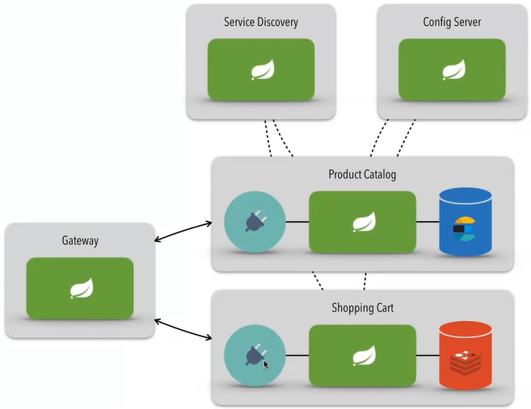

# Introdução a arquitetura de microserviços utilizando Spring

Foi utilizado serviços em Spring Boot afim de exemplificar a arquitetura de microserviços.

Temos dois serviços básicos responsáveis por lidar com o negócio, como exemplo foi pensado dois serviços de uma loja online.

- Catálogo de produtos 
- Carrinhos de compras

O serviços de produtos(product-catalog) se conecta no Elastic Search que fica como responsável pelo armazenamento do cadastro de produtos.

Já o serviços de carrinho de compras(shopping-cart), recebe os dados contendo os produtos do carrinho e envia para o Redis realizar o cache do carrinho.

## Arquitetura

Temos um serviço responsável pela configuração dos outros serviços(config-server) que dinamicamente busca as configurações através de um repositório [Configuration Repo](https://github.com/gabrielpadilh4/configuration-files-spring-cloud-projeto-microservices-dio).

Com base nas configurações carregadas pelo config server, os serviços de catálogo de produtos e carrinho de compras se conecta no serviço de descoberta(service-discovery) que é responsável por centralizar os serviços e também atuar como um load balance para cada instância.

Já o gateway se conecta no service discovery e através de configuração serve de ponte entre o endpoint exposto(onde a aplicação frontend, api externa, etc irá realizar as requisições) e os microserviços registrados no service discovery.

Diagrama abaixo:

